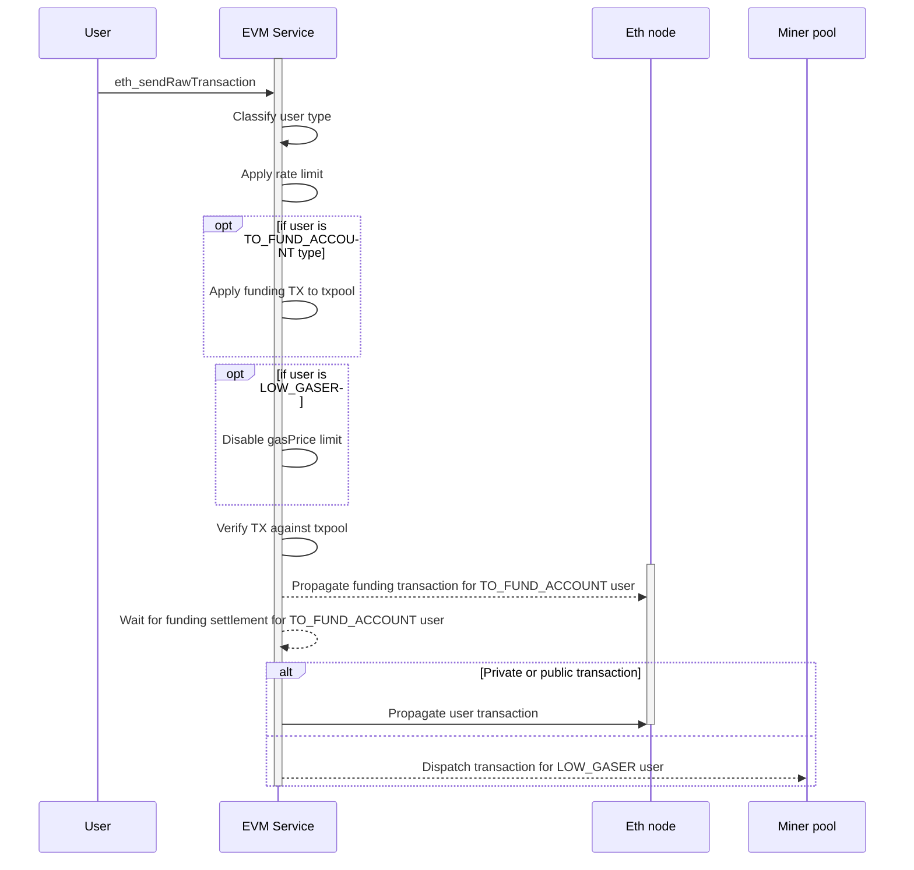

+++
title = "Altfury a remote wallet provider (GSaaS*) design document - Work In Progress"
date = "2021-02-13T19:00:03+01:00"
tags = ["ethereum", "rpc", "gsaas", "altfury"]
description = ""
showFullContent = false
readingTime = true
hideComments = false
color = "" #color from the theme settings
+++

## Motivationale

With around [2000 DApps](https://dappradar.com/rankings/protocol/ethereum/87) and more than [60.000 users](https://dappradar.com/rankings/protocol/ethereum), the promise of 27.000 tx/s with Ethereum 2.0 and people arguing for Infura centralizing the public Ethereum world there is call for alternative!
Altfury aims to provide to anyone the ability to interact with DApps and any smart contract without the need of paying gas.

Your user don't have a wallet?

You can let us take care of your keys and the burden to not forget and secure them while enjoying the DeFi space faster than ever.
DApp developers, the Ethereum world to your users with only the change of your endpoint URL address.
Users, hassle free access to the DeFi world

No burden to use a new SDK in your DApps, work with standard Wallet Connect (Uniswap & al)!
Peepz, just to go the website (optional install browser extension) pair up and go!

*Gas Station As A Service (GSAAS)

# Intro

The goal of this document is to provide a design of a high-available service providing Ethereum JSON RPC endpoints over HTTP and HTTP WebSocket and other related services such as fee (tx) management to act as a drop-in repleacement (or plugin to existing wallet connectors).

### Technical note

In addition, the endpoint SHOULD allow:
 - For unfunded Ethereum account to pass transaction on the blockchain under certain condition
Withhold transaction then
 - Guaranteed transaction inclusion with low gas price fee
For this specific feature, there is multiple ways to achieve this
Pass transaction off-band to a partner miner pool that would accept transaction with a **gasPrice** set at **0** _or_ fund the account via a faucet to the **gasLimit** x **gasPrice** while withholding 
the transaction until funding is done and then propagate it.

## Definition

A remote wallet provider is a service that aims to help distant services to execute(read calls), sign(key control) and transmit transaction(write calls)

It integrate seamlessly by emulating a blockchain state with a balance corresponding for the credit of each account creating an ephemeral blockchain network (next_view(state, account_balances)->fork_view, a fork of the mainnet displaying accounts as if they have the corresponding amount making the experience seamless as

## Customers

 - Bots
 - NoCode users
 - User that click on interface (browser extension, https://twitter.com/P3b7_/status/1361345964259352580?s=19)
 - User willing to invest to rely on this for automation
 - User that do their on smart contract automation

Todo do market research to describe personas

## Future of work

 - Provide services about key usage (defi liquidity mining, ...)

## Architecture

SHOULD be as minimal as possible to have a low footprint/cost
 (front-end requests (administration, user management, ...)).
Use go-ethereum as library to avoid technical debt as much as possible.

-> Wondering if serverless could be a benefit if it were handling execution read calls, this might be costly if not self-hosted

-> Browser extention to change the RPC endpoint easily
-> Ledger device with dedicated credit app
-> Website where account can be toped-up by XXX means

# Security

Per ethereum account (extracted from transaction signature) whitelisting.
Per application(what), per logged user (who)
Anonymous user SHOULD be limited by IP(Handle IPv6 per /64 block?):
 - Rate in second
 - Total number of concurrent connection
 - Time limit on connection

USER_TYPE: 
 - LOW_GASER
 - TO_FUND_ACCOUNT
 - ANONYMOUS
# New usages possible out of that

 - Send NFT anonymously via TornadoCash integration

## Allowed usage pattern

 - Authorize (max amount?)
 - Trade
 - Trade
 - ... max amount before security callbacks?

## Regulatory limits

Is this such a thing for DeFi?
Tax?

## Fraud prevention / whitelisting system

Smart-contract based?

### Providing an ephemeral ethereum state

 - Modify https://github.com/ledgerwatch/turbo-geth/blob/master/consensus/ethash/sealer.go#L166 to wait on a channel instead of searching for the nonce and set a MAGIC MixDigest to permit identification of a special block to be included on the canonical chain without verification
 - Prevent MAGIC block propagation throught

# Transaction payment to miner

The payment is distributed to the block.coinbase each block containing private transaction (and potentially a lower than usual gas price)

Todo expand idea of private transaction via on-chain payment -> find a settlement cost minimal (ticket+payment channel)

### Transaction flow

#### Write flows

#### Read flows

Todo

## Documentation

[Pricing](https://docs.google.com/spreadsheets/d/1iOHnC1MkwcXxN-Gisk9nWeWIRfR6ZaWAXLtYL37NCzE/edit?pli=1#gid=0)
https://github.com/ethereum/wiki/wiki/JSON-RPC
https://www.stateofthedapps.com/stats

## Ethereum RPC

### Modified RPC

**eth_call** due to `gasPrice` parameter
**eth_estimateGas** due to `gasPrice` parameter

#### eth_gasPrice

Should reflect the gasPrice we want either low or high depending of the kind of transaction we expect to see either through a miner pool or pre-funding.

#### eth_sendRawTransaction

Custom implementation of this RPC, depending on USER_TYPE

### Non stream RPC

* eth_accounts
* eth_blockNumber
* eth_call
* eth_chainId
* eth_getBalance
* eth_getBlockByHash
* eth_getBlockByNumber
* eth_getBlockTransactionCountByHash
* eth_getBlockTransactionCountByNumber
* eth_getCode
* eth_getLogs
* eth_getStorageAt
* eth_getTransactionByBlockHashAndIndex
* eth_getTransactionByBlockNumberAndIndex
* eth_getTransactionByHash
* eth_getTransactionCount
* eth_getTransactionReceipt
* eth_getUncleByBlockHashAndIndex
* eth_getUncleByBlockNumberAndIndex
* eth_getUncleCountByBlockHash
* eth_getUncleCountByBlockNumber
* eth_getWork
* eth_hashrate
* eth_mining
* eth_protocolVersion
* eth_submitWork
* eth_syncing

* net_listening
* net_peerCount
* net_version

* web3_clientVersion

### Streams RPC

* eth_newFilter
* eth_newPendingTransactionFilter
* eth_getFilterChanges
* eth_getFilterLogs
* eth_uninstallFilter
* eth_subscribe
* eth_unsubscribe

## Notes

- Fast Transaction Pool, low latency viewer / transaction sender
 - Connect to peers, fetch memory pool, behave as light relay node
  - Provide transaction mempool view and fast transaction dispatching
 - Populate a central database for constant time access via API (paid access ?)
 - Monitor transaction to addresses, on update
 - Callback to backend customers through a fast protocol (GRPC?REST?...?)
 - Trigger registered function (e.g: send transaction)
 - World infrastructure required (node in each world, potentially  costly + dev ops)
 - Dashboard with world view of ethereum compatible blockchain
 - Speed transaction sending for quick transaction dispatching
 - Would require ethereum node modification

